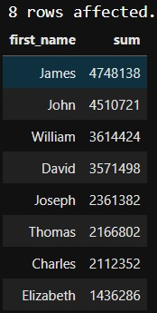
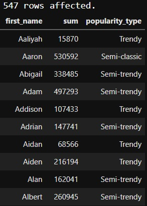
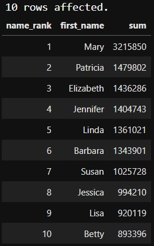
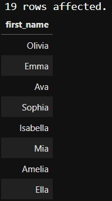
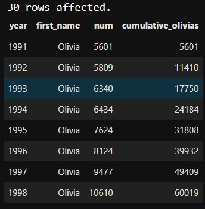
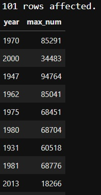
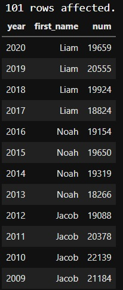
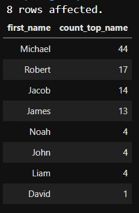

#Analyzing American Baby Name Trends

How have baby name preferences in the United States changed since 1920? Which names have kept popular for more than a century, and how do they compare to the most recent top baby names? These are important considerations for many new parents, but the skills we'll learn while answering these questions are universal. After all, many businesses rely on knowing trends and popularity.

We'll be using data from the United States Social Security Administration, which gives first names as well as the number and gender of kids born in each year. We've limited the dataset to first names given to over 5,000 American births in a particular year to improve processing time. Our data set includes 101 years, from 1920 to 2020.

<h3 id="baby_names"><code>baby_names</code></h3>
<table>
<thead>
<tr>
<th style="text-align:left;">column</th>
<th>type</th>
<th>meaning</th>
</tr>
</thead>
<tbody>
<tr>
<td style="text-align:left;"><code>year</code></td>
<td>int</td>
<td>year</td>
</tr>
<tr>
<td style="text-align:left;"><code>first_name</code></td>
<td>varchar</td>
<td>first name</td>
</tr>
<tr>
<td style="text-align:left;"><code>sex</code></td>
<td>varchar</td>
<td><code>sex</code> of babies given <code>first_name</code></td>
</tr>
<tr>
<td style="text-align:left;"><code>num</code></td>
<td>int</td>
<td>number of babies of <code>sex</code> given <code>first_name</code> in that <code>year</code></td>
</tr>
</tbody>
</table>

Now we will investigate the data by categorizing it into eight categories.
1. Classic American names
- Select first names and the total babies with that first_name
- Group by first_name and filter for those names that appear in all 101 years
- Order by the total number of babies with that first_name, descending

> SELECT
    first_name,
    SUM(num)
FROM baby_names
GROUP BY first_name
HAVING COUNT(first_name) = 101
ORDER BY SUM(num) DESC ;

2. Timeless or trendy
- Classify first names as 'Classic', 'Semi-classic', 'Semi-trendy', or 'Trendy'
- Alias this column as popularity_type
- Select first_name, the sum of babies who have ever had that name, and popularity_type
- Order the results alphabetically by first_name

> SELECT
    first_name,
    SUM(num),
    CASE WHEN COUNT(first_name) > 80 THEN 'Classic'
         WHEN COUNT(first_name) > 50 THEN 'Semi-classic'
         WHEN COUNT(first_name) > 20 THEN 'Semi-trendy'
         ELSE 'Trendy' END AS popularity_type
    FROM baby_names
    GROUP BY first_name
    ORDER BY first_name ASC;

3. Top-ranked female names since 1920
-  RANK names by the sum of babies who have ever had that name (descending), aliasing as name_rank
- Select name_rank, first_name, and the sum of babies who have ever had that name
- Filter the data for results where sex equals 'F'
- Limit to ten results

> SELECT
    RANK() OVER(ORDER BY SUM(num) DESC) AS name_rank,
    first_name,
    SUM(num)
FROM baby_names
WHERE sex = 'F'
GROUP BY first_name
LIMIT 10;

4. Picking a baby name
- Select only the first_name column
- Filter for results where sex is 'F', year is greater than 2015, and first_name ends in 'a'
- Group by first_name and order by the total number of babies given that first_name.

> SELECT first_name
FROM baby_names
WHERE sex = 'F' AND year > 2015 AND first_name LIKE '%a'
GROUP BY first_name
ORDER BY SUM(num) DESC

5. The Olivia expansion
- Select year, first_name, num of Olivias in that year, and cumulative_olivias
- Sum the cumulative babies who have been named Olivia up to that year; alias as cumulative_olivias
- Filter so that only data for the name Olivia is returned.
- Order by year from the earliest year to most recent.

> SELECT
    year,
    first_name,
    num,
    SUM(num) OVER(ORDER BY year) AS cumulative_olivias
FROM baby_names
WHERE first_name = 'Olivia'
ORDER BY year

6. Many males with the same name
-  Select year and maximum number of babies given any one male name in that year, aliased as max_num
- Filter the data to include only results where sex equals 'M'.

> SELECT
    year,
    MAX(num) AS max_num
FROM baby_names
WHERE sex = 'M'
GROUP BY year

7. Top male names over the years
- Select year, first_name given to the largest number of male babies, and num of babies given that name
- Join baby_names to the code in the last task as a subquery
- Order results by year descending.
> SELECT 
    b.year,
    first_name,
    num
FROM baby_names AS b
INNER JOIN (SELECT
                year,
                MAX(num) AS max_num
                FROM baby_names
                WHERE sex = 'M'
                GROUP BY year) AS sub 
ON b.year = sub.year AND b.num = sub.max_num
ORDER BY b.year DESC

8. The most years at number one
- Select first_name and a count of years it was the top name in the last task; alias as count_top_name
- Use the code from the previous task as a common table expression
- Group by first_name and order by count_top_name descending.
> WITH top_male_names AS (
    SELECT 
    b.year,
    first_name,
    num
FROM baby_names AS b
INNER JOIN (SELECT
                year,
                MAX(num) AS max_num
                FROM baby_names
                WHERE sex = 'M'
                GROUP BY year) AS sub 
ON b.year = sub.year AND b.num = sub.max_num
ORDER BY b.year DESC
)
SELECT
    first_name,
    COUNT(year) AS count_top_name
FROM top_male_names
GROUP BY first_name
ORDER BY count_top_name DESC;

